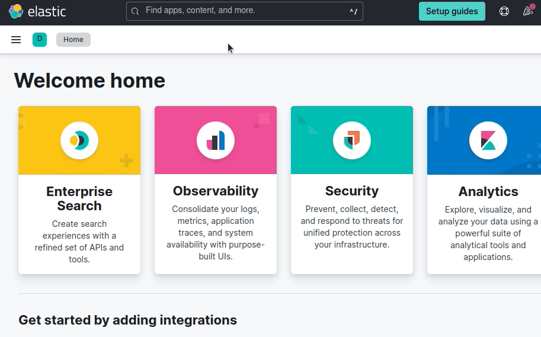
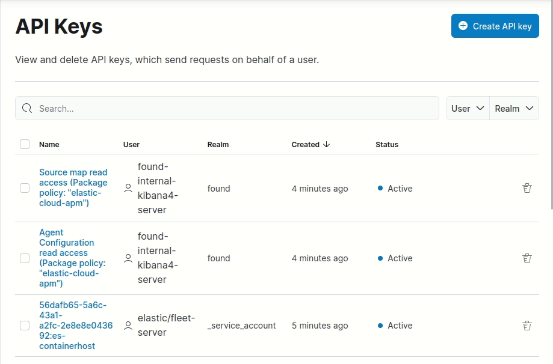

# Elasticsearch Serverless Client

[](https://github.com/elastic/elasticsearch-serverless-ruby/actions/workflows/tests.yml)

This is the official Elastic client for the **Elasticsearch Serverless** service. If you're looking to develop your Ruby application with the Elasticsearch Stack, you should look at the [Elasticsearch Client](https://github.com/elastic/elasticsearch-ruby) instead. If you're looking to develop your Ruby application with Elastic Enterprise Search, you should look at the [Enterprise Search Client](https://github.com/elastic/enterprise-search-ruby/).

## Guide

For now this gem is only available through its source code. You can install the Elasticsearch Serverless Ruby Client with the following commands:

```bash
$ gem build elasticsearch-serverless.gemspec
$ gem install elasticsearch-serverless-x.x.x.gem
```

Or include it in your Ruby project's Gemfile:

```ruby
gem 'elasticsearch-serverless', path: '../path/to/client-code'
```

You can find a rake task to run a Ruby console with the client in the project's code:

```bash
$ bundle exec rake console
```

### Instantiate a Client

You need to be using the Elastiscearch Serverless service in order to use the `elasticsearch-serverless` gem. You will need your deployment's endpoint for Elasticsearch and an API key.

In your Cloud deployment management page, copy the endpoint for Elasticsearch and save it:



Then create a new API Key and save its value:



You can now instantiate a client with these values:

```ruby
client = ElasticsearchServerless::Client.new(
  api_key: 'your_api_key',
  url: 'https://my-deployment-url'
)
```

### Using the API

Once you've instantiated a client with your API key and Elasticsearch endpoint, you can use the **Info API** to check that you can connect to the Serverless server. The info API returns information from the Elasticsearch Serverless service you are running:

```ruby
> response = client.info
> response
 =>
#<ElasticsearchServerless::API::Response:0x00007f387ba973c8
 @response=
  #<Elastic::Transport::Transport::Response:0x00007f387b3afab0
   @body=
    {"name"=>"instance-0000000000",
     "cluster_name"=>"77b1c8d1edc74b7ea447bb307496a987",
     "cluster_uuid"=>"CZHOOLPnSRe3eYDkwA43hA",
     "version"=>
      {"number"=>"8.8.0-SNAPSHOT",
       "build_flavor"=>"default",
       "build_type"=>"docker",
       "build_hash"=>"8432a5a3666624a4a989aa6b4d9c4477e4602f6c",
       "build_date"=>"2023-04-17T18:47:52.323690096Z",
       "build_snapshot"=>true,
       "lucene_version"=>"9.6.0",
       "minimum_wire_compatibility_version"=>"7.17.0",
       "minimum_index_compatibility_version"=>"7.0.0"},
     "tagline"=>"You Know, for Search"},
   @headers=
    {"content-encoding"=>"gzip",
     "content-length"=>"353",
     "content-type"=>"application/json",
     "x-cloud-request-id"=>"dCMaszerQcKE4CsJdWFprQ",
     "x-elastic-product"=>"Elasticsearch",
     "x-found-handling-cluster"=>"77b1c8d1edc74b7ea447bb307496a987",
     "x-found-handling-instance"=>"instance-0000000000",
     "date"=>"Tue, 18 Apr 2023 09:10:31 GMT"},
   @status=200>>
```

The client will return an API Response object. You can see the HTTP return code by calling `status` and the HTTP headers by calling `headers` on the response object. The Response object behaves as a Hash too, so you can access the body values directly:

```ruby
> response['version']
 =>
{"number"=>"8.8.0-SNAPSHOT",
 "build_flavor"=>"default",
 "build_type"=>"docker",
 "build_hash"=>"8432a5a3666624a4a989aa6b4d9c4477e4602f6c",
 "build_date"=>"2023-04-17T18:47:52.323690096Z",
 "build_snapshot"=>true,
 "lucene_version"=>"9.6.0",
 "minimum_wire_compatibility_version"=>"7.17.0",
 "minimum_index_compatibility_version"=>"7.0.0"}
```

You can now start ingesting documents into Elasticsearch Service. You can use the **Bulk API** for this. This API allows you to index, update and delete several documents in one request. You call the `bulk` API on the client with a body parameter, an Array of hashes that define the action and a document. Here's an example of indexing some classic books into the `books` index:

```ruby
# First we build our data:
body = [
  { index: { _index: 'books', data: {name: "Snow Crash", "author": "Neal Stephenson", "release_date": "1992-06-01", "page_count": 470} } },
  { index: { _index: 'books', data: {name: "Revelation Space", "author": "Alastair Reynolds", "release_date": "2000-03-15", "page_count": 585} } },
  { index: { _index: 'books', data: {name: "1984", "author": "George Orwell", "release_date": "1985-06-01", "page_count": 328} } },
  { index: { _index: 'books', data: {name: "Fahrenheit 451", "author": "Ray Bradbury", "release_date": "1953-10-15", "page_count": 227} } },
  { index: { _index: 'books', data: {name: "Brave New World", "author": "Aldous Huxley", "release_date": "1932-06-01", "page_count": 268} } },
  { index: { _index: 'books', data: {name: "The Handmaid's Tale", "author": "Margaret Atwood", "release_date": "1985-06-01", "page_count": 311} } }
]
# Then we send the data via the bulk api:
> response = client.bulk(body: body)
# And we can check that the items were indexed and given an id in the response:
> response['items']
 =>
[{"index"=>{"_index"=>"books", "_id"=>"Pdink4cBmDx329iqhzM2", "_version"=>1, "result"=>"created", "_shards"=>{"total"=>2, "successful"=>1, "failed"=>0}, "_seq_no"=>0, "_primary_term"=>1, "status"=>201}},
 {"index"=>{"_index"=>"books", "_id"=>"Ptink4cBmDx329iqhzM2", "_version"=>1, "result"=>"created", "_shards"=>{"total"=>2, "successful"=>1, "failed"=>0}, "_seq_no"=>1, "_primary_term"=>1, "status"=>201}},
 {"index"=>{"_index"=>"books", "_id"=>"P9ink4cBmDx329iqhzM2", "_version"=>1, "result"=>"created", "_shards"=>{"total"=>2, "successful"=>1, "failed"=>0}, "_seq_no"=>2, "_primary_term"=>1, "status"=>201}},
 {"index"=>{"_index"=>"books", "_id"=>"QNink4cBmDx329iqhzM2", "_version"=>1, "result"=>"created", "_shards"=>{"total"=>2, "successful"=>1, "failed"=>0}, "_seq_no"=>3, "_primary_term"=>1, "status"=>201}},
 {"index"=>{"_index"=>"books", "_id"=>"Qdink4cBmDx329iqhzM2", "_version"=>1, "result"=>"created", "_shards"=>{"total"=>2, "successful"=>1, "failed"=>0}, "_seq_no"=>4, "_primary_term"=>1, "status"=>201}},
 {"index"=>{"_index"=>"books", "_id"=>"Qtink4cBmDx329iqhzM2", "_version"=>1, "result"=>"created", "_shards"=>{"total"=>2, "successful"=>1, "failed"=>0}, "_seq_no"=>5, "_primary_term"=>1, "status"=>201}}]

```

Now that some data is available, you can search your documents using the **Search API**:

```ruby
> response = client.search(index: 'books', q: 'snow')
> response['hits']['hits']
 => [{"_index"=>"books", "_id"=>"Pdink4cBmDx329iqhzM2", "_score"=>1.5904956, "_source"=>{"name"=>"Snow Crash", "author"=>"Neal Stephenson", "release_date"=>"1992-06-01", "page_count"=>470}}]
```

## Development

See [CONTRIBUTING](./CONTRIBUTING.md).

### Docs

Some questions, assumptions and general notes about this project can be found in [the docs directory](./docs/questions-and-assumptions.md).
