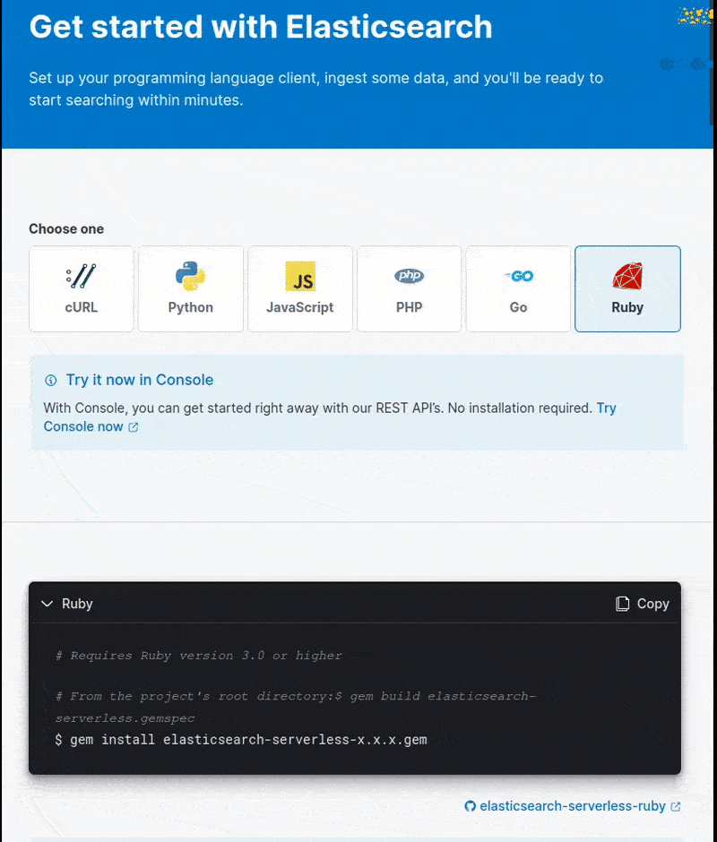

# Elasticsearch Serverless Client

[](https://github.com/elastic/elasticsearch-serverless-ruby/actions/workflows/tests.yml)

This is the official Elastic client for the **Elasticsearch Serverless** service. If you're looking to develop your Ruby application with the Elasticsearch Stack, you should look at the [Elasticsearch Client](https://github.com/elastic/elasticsearch-ruby) instead. If you're looking to develop your Ruby application with Elastic Enterprise Search, you should look at the [Enterprise Search Client](https://github.com/elastic/enterprise-search-ruby/).

## Guide

You need to have Ruby version 3.0 or higher installed to use this gem.

You can install the Elasticsearch Serverless Ruby Client from GitHub's releases:

```bash
$ gem install elasticsearch-serverless --source "https://github.com/elastic/elasticsearch-serverless-ruby/releases/download/v0.0.7.20231031.pre/elasticsearch-serverless-0.0.7.20231031.pre.gem"

```

Check [releases](https://github.com/elastic/elasticsearch-serverless-ruby/releases) for the latests available versions.

You can also install the gem from its source code with the following commands:

```bash
# From the project's root directory:
$ gem build elasticsearch-serverless.gemspec
$ gem install elasticsearch-serverless-x.x.x.gem
```

Or include it in your Ruby project's Gemfile:

```ruby
gem 'elasticsearch-serverless', path: '../path/to/client-code'
```

Additionally, you can find a rake task in the project's code to run a Ruby console with the required librares to use the client loaded into it:

```bash
$ bundle exec rake console
```


### Instantiate a Client

You need to be using the Elastiscearch Serverless service in order to use the `elasticsearch-serverless` gem. You will need your deployment's endpoint for Elasticsearch and an API key.

In your Elasticsearch Serverless Cloud deployment home page, create an API Key and copy the generated code:



You can now instantiate a client with the values you got:

```ruby
client = ElasticsearchServerless::Client.new(
  api_key: 'your_api_key',
  url: 'https://my-deployment-url'
)
```

### Configuration

Elasticsearch Serverless Ruby uses [elastic-transport](github.com/elastic/elastic-transport-ruby/) as the HTTP layer to connect to Elasticsearch Serverless. You can use some of the following parameters when instatiating a client in the `arguments` hash like so:

```ruby
client = ElasticsearchServerless::Client.new(
  api_key: 'API_KEY',
  url: 'URL',
  arguments: {
    adapter: :net_http_persistent,
    log: true,
    logger: MyLogger.new
  }
)
```

The parameters are:

| Key                | Type      | Description                                                                                                                        |
|--------------------|-----------|------------------------------------------------------------------------------------------------------------------------------------|
| `adapter`          | `string`  | A specific adapter for Faraday (`patron`, `typhoeus`, `HTTPClient`, `NetHttpPersistent`).                                          |
| `log`              | `boolean` | Log requests and responses to standard output with the default logger (an instance of Ruby’s ::Logger class), disabled by default. |
| `logger`           | `Logger`  | An instance of a Logger-compatible object to use as a logger.                                                                      |
| `trace`            | `boolean` | Use the default tracer to trace requests and responses in the Curl format.                                                         |
| `tracer`           | `Logger`  | An instance of a Logger-compatible object to use as a tracer.                                                                      |
| `serializer_class` | `Object`  | A specific serializer class to use to serialize JSON.                                                                              |
| `headers`          | `Hash`    | Custom HTTP Request Headers                                                                                                        |


### Using the API

See [APIs](https://github.com/elastic/elasticsearch-serverless-ruby/blob/main/docs/apis.md) for the full list of available endpoints.

Once you've instantiated a client with your API key and Elasticsearch endpoint, you can start ingesting documents into Elasticsearch Service. You can use the **Bulk API** for this. This API allows you to index, update and delete several documents in one request. You call the `bulk` API on the client with a body parameter, an Array of hashes that define the action and a document. Here's an example of indexing some classic books into the `books` index:

```ruby
# First we build our data:
documents = [
  { index: { _index: 'books', data: {name: "Snow Crash", author: "Neal Stephenson", release_date: "1992-06-01", page_count: 470} } },
  { index: { _index: 'books', data: {name: "Revelation Space", author: "Alastair Reynolds", release_date: "2000-03-15", page_count: 585} } },
  { index: { _index: 'books', data: {name: "1984", author: "George Orwell", release_date: "1949-06-08", page_count: 328} } },
  { index: { _index: 'books', data: {name: "Fahrenheit 451", author: "Ray Bradbury", release_date: "1953-10-15", page_count: 227} } },
  { index: { _index: 'books', data: {name: "Brave New World", author: "Aldous Huxley", release_date: "1932-06-01", page_count: 268} } },
  { index: { _index: 'books', data: {name: "The Handmaid's Tale", author: "Margaret Atwood", release_date: "1985-06-01", page_count: 311} } }
]
# Then we send the data via the bulk api:
> response = client.bulk(body: documents)
# And we can check that the items were indexed and given an id in the response:
> response['items']
 =>
[{"index"=>{"_index"=>"books", "_id"=>"Pdink4cBmDx329iqhzM2", "_version"=>1, "result"=>"created", "_shards"=>{"total"=>2, "successful"=>1, "failed"=>0}, "_seq_no"=>0, "_primary_term"=>1, "status"=>201}},
 {"index"=>{"_index"=>"books", "_id"=>"Ptink4cBmDx329iqhzM2", "_version"=>1, "result"=>"created", "_shards"=>{"total"=>2, "successful"=>1, "failed"=>0}, "_seq_no"=>1, "_primary_term"=>1, "status"=>201}},
 {"index"=>{"_index"=>"books", "_id"=>"P9ink4cBmDx329iqhzM2", "_version"=>1, "result"=>"created", "_shards"=>{"total"=>2, "successful"=>1, "failed"=>0}, "_seq_no"=>2, "_primary_term"=>1, "status"=>201}},
 {"index"=>{"_index"=>"books", "_id"=>"QNink4cBmDx329iqhzM2", "_version"=>1, "result"=>"created", "_shards"=>{"total"=>2, "successful"=>1, "failed"=>0}, "_seq_no"=>3, "_primary_term"=>1, "status"=>201}},
 {"index"=>{"_index"=>"books", "_id"=>"Qdink4cBmDx329iqhzM2", "_version"=>1, "result"=>"created", "_shards"=>{"total"=>2, "successful"=>1, "failed"=>0}, "_seq_no"=>4, "_primary_term"=>1, "status"=>201}},
 {"index"=>{"_index"=>"books", "_id"=>"Qtink4cBmDx329iqhzM2", "_version"=>1, "result"=>"created", "_shards"=>{"total"=>2, "successful"=>1, "failed"=>0}, "_seq_no"=>5, "_primary_term"=>1, "status"=>201}}]

```

When you use the client to make a request to Elasticsearch, it will return an API Response object. You can see the HTTP return code by calling `status` and the HTTP headers by calling `headers` on the response object. The Response object behaves as a Hash too, so you can access the body values directly as seen on the previous example with `response['items']`.


You can call the `update` API to update a document:

```ruby
response = client.update(
  index: 'books', 
  id: 'document_id', 
  body: { doc: { page_count: 312 } }
)
```

You can call the `delete` API to delete a document:

```ruby
client.delete(index: 'books', id: 'Ptink4cBmDx329iqhzM2')
```

Now that some data is available, you can search your documents using the **Search API**:

```ruby
> response = client.search(index: 'books', q: 'snow')
> response['hits']['hits']
 => [{"_index"=>"books", "_id"=>"Pdink4cBmDx329iqhzM2", "_score"=>1.5904956, "_source"=>{"name"=>"Snow Crash", "author"=>"Neal Stephenson", "release_date"=>"1992-06-01", "page_count"=>470}}]
```

## Development

See [CONTRIBUTING](./CONTRIBUTING.md).
